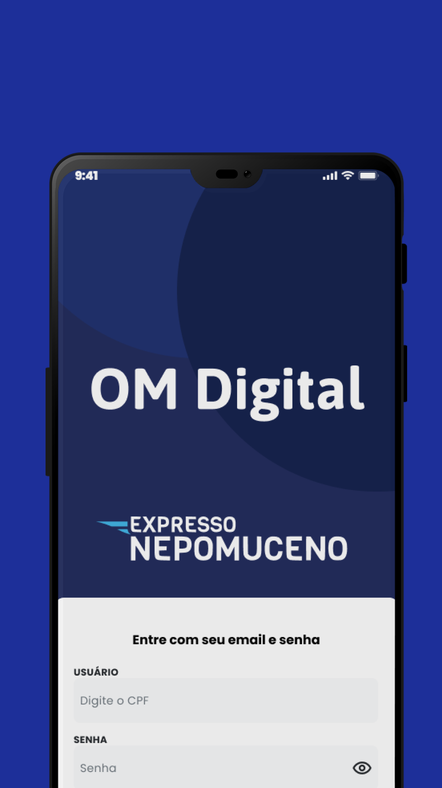
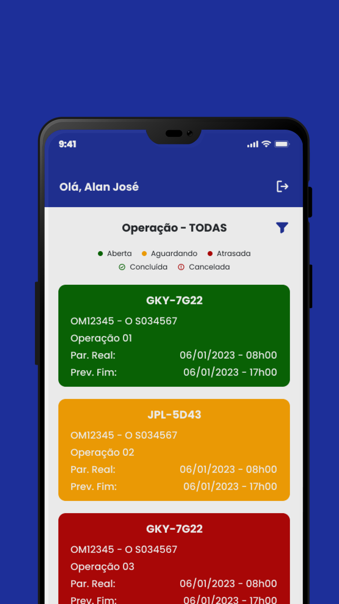
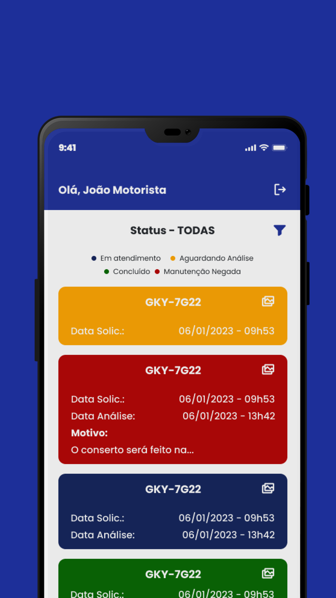
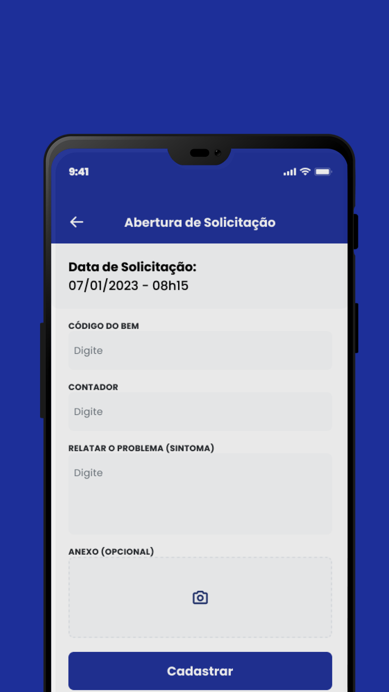

# OM Digital 🚚🛠️

Bem-vindo ao OM Digital, uma poderosa ferramenta para a gestão de frotas de caminhões e máquinas em manutenção. Este aplicativo foi desenvolvido com React Native, TypeScript, Expo e estilizado com TailwindCSS, proporcionando uma experiência intuitiva e eficiente.

  

## Recursos Principais

- **Múltiplas Visões de Usuário**:
  - **Operador**: Gerencie ordens de manutenção (OMs), pause, inicie e finalize OMs, cadastre, edite e exclua etapas e sintomas dentro de cada OM.
  - **Gestor de Manutenção**: Visualize as OMs e etapas, aceite ou recuse novas solicitações que se transformarão em ordens de manutenção.
  - **Gestor de Logística**: Acesse informações sobre o número de veículos disponíveis.
  - **Solicitante**: Visualize o andamento de solicitações e abra novas solicitações.

## Como Testar

O aplicativo está disponível para teste e pode ser acessado a partir do seguinte link: https://play.google.com/store/apps/details?id=com.mvxsistemas.omdigital

Estamos ansiosos para receber seus comentários e sugestões para melhorias!

## Capturas de Tela

  
  
  
  

  

  

  

---

**Equipe EMGP Sistemas** 🚚🛠️
